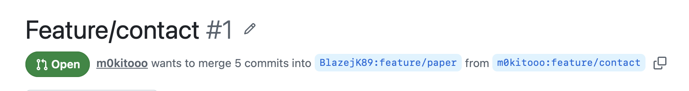
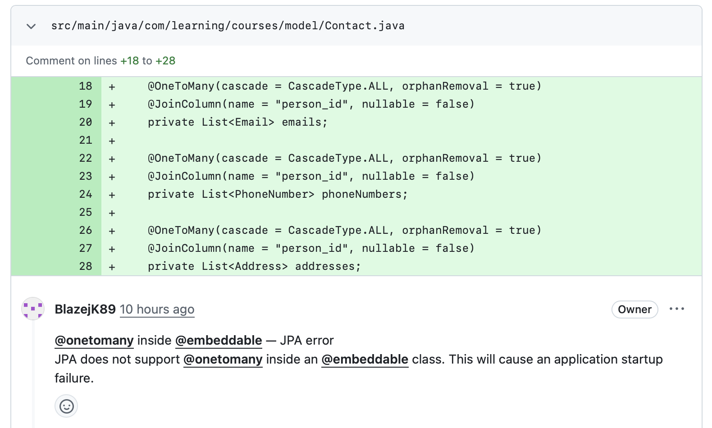
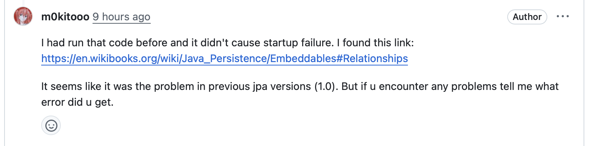
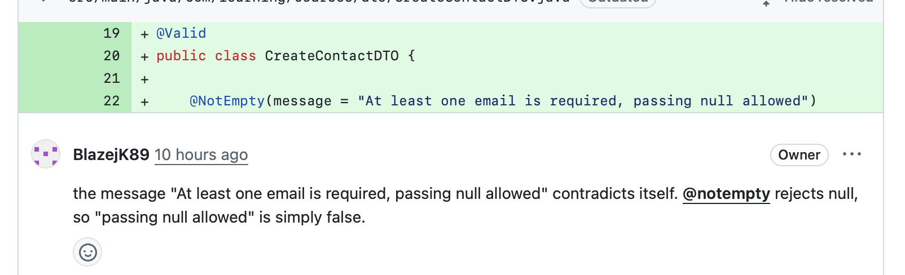
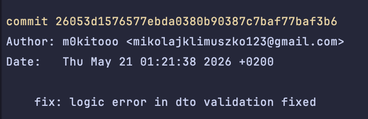
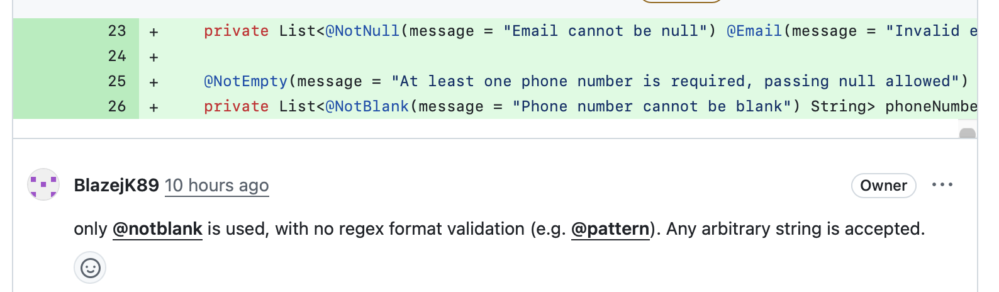
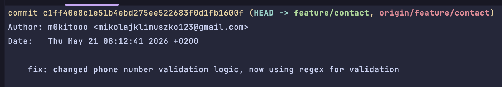
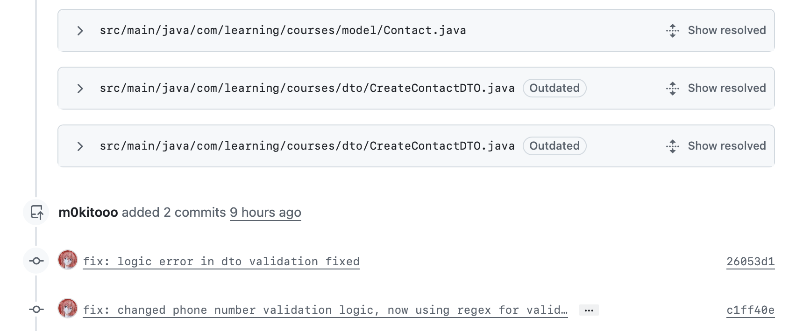

# Lab 10 - Code Review Report

## Overview

The goal of this lab was to practice the code review process using GitHub pull requests. Each student implemented an assigned functionality, created a pull request, and then reviewed a colleague's pull request.

## Assigned Functionality

I was assigned to implement the **Contact** functionality - a `Contact` object storing student contact information such as email, address, and phone number, with support for multiple contacts per student.

## Implementation

The implementation was done on a new branch created from `feature/lab-08`. The `Contact` object was created with a one-to-many relationships on each field contact field.

After completing the implementation, a pull request was created targeting the colleague's branch.

## Code Review - Received

My pull request was reviewed by a colleague. Three issues were identified during the review.

**Problem 1** - The reviewer pointed out an issue in the code:

I acknowledged the comment and provided a response pointing out that there seems to be no issue:

**Problem 2** - The reviewer identified another issue:

The issue was addressed and fixed with a follow-up commit:

**Problem 3** - A third issue was raised:

The fix was applied in a separate commit:

All issues got resolved:

## Communication

Communication with the reviewer was clear and straightforward. All comments were constructive and easy to understand.

## Summary

The lab provided practical experience with peer code review on GitHub. The review process helped identify real issues in the implementation and improve overall code quality.

